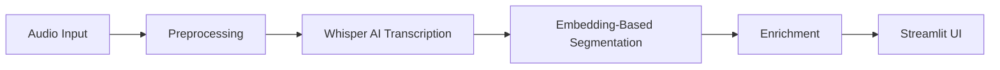

# Automated Podcast Transcription and Topic Segmentation

## 1. Project Overview

This project addresses the challenge of navigating long-form audio content. Podcasts often exceed 60 minutes, making it difficult for listeners to locate specific topics without listening to the entire episode.

We developed an AI-powered pipeline that automatically transcribes audio, segments it into coherent semantic topics using embedding-based similarity, and provides efficient navigation.

**Key Objectives:**

* **Transcription:** Convert raw audio to accurate text using OpenAI's Whisper model.
* **Segmentation:** Automatically detect topic shifts using semantic embeddings (SentenceTransformers) rather than simple keyword matching.
* **Navigation:** Build a searchable, interactive UI to jump to specific topics immediately.

---

## 2. Dataset Description

The system was developed and validated using a diverse collection of **16 podcast episodes**, categorized by length and complexity to ensure robust testing:

* **Long-Form Validation Set (10 Episodes):** Used for the Week 6 System Testing and Loop/Segmentation validation.
* **9 Episodes** of the *Lex Fridman Podcast* (Deep technical/philosophical conversations, 2–3 hours each).
* **1 Episode** of *BBC Global News* (Rapid topic switching, ~30 mins).


* **Short-Form Dev Set (6 Episodes):**
* **6 Episodes** of *The Habit Coach Podcast* (5–10 mins each). Used for rapid prototyping and unit testing during initial development.


**Preprocessing:** All audio files were standardized to **16kHz Mono WAV** format to ensure compatibility with the Whisper model.

**Data Access:**
Due to the large size of the processed audio files, they are not hosted directly on GitHub.

* **Input Audio:** [Google Drive Link](https://drive.google.com/drive/folders/1b-UchpygkaNAT_0Uqpmm6PUAFNTwsnOo)
* **Processed Audio:** [Google Drive Link](https://drive.google.com/drive/folders/1VUw6MQ_yohe9aMr6Lrql8oTQ07a7b-Ti)
* **Audio Chunks:** [Google Drive Link](https://drive.google.com/drive/folders/1o-2Ps9UwJk39pFwEdEtNNszfdX9z6gOJ)
* **Processed Transcripts (JSON):** [Google Drive Link](https://drive.google.com/drive/folders/1AwbyNo-0rXBFFYLJPs0wF2AJkuDZ8P18)
* **Segments Produced (JSON):** [Google Drive Link](https://drive.google.com/drive/folders/1wBGhUjAVtQNNglZnRAX9rDo9spFIWDAv)
* **Model used for summary generation:** [Google Drive Link](https://drive.google.com/drive/folders/1HUyFz0Gtw5NsHhzqrWJ3PgXWTa4ptELj)

---

## 3. System Architecture

The application follows a modular pipeline architecture:



1. **Audio Preprocessing:** Audio standardization (16 kHz mono, 16-bit PCM), denoising, loudness normalization, silence trimming, and metadata-aware chunking (`audio_preprocessing.py`).
2. **Transcription:** Generating timestamped text (`transcription_generation.py`).
3. **Segmentation:** Semantic similarity analysis (`embedding_segmentation.py`).
4. **Enrichment:** Summarization (T5), Keywords (TF-IDF), and Sentiment (VADER).
5. **Visualization:** Interactive Timeline and Keyword Clouds (`app.py`).

---

## 4. Tools and Libraries Used

* **Audio Processing:** `LibROSA` (Loading/Conversion), `Pydub` (Chunking).
* **Speech-to-Text:** `OpenAI Whisper` (Base model) for high-accuracy transcription with timestamps.
* **NLP & Segmentation:** `SentenceTransformers` (all-MiniLM-L6-v2) for semantic vectorization; `scikit-learn` for Cosine Similarity.
* **Summarization:** `HuggingFace Transformers` (T5-small).
* **Sentiment Analysis:** `VADER Sentiment` (NLTK) for polarity scoring.
* **User Interface:** `Streamlit` (Web App), `Altair` (Timeline), `WordCloud`.

---

## 5. Implementation Details

### A. Transcription

We utilized the **Whisper Base** model. The audio is processed in 10-minute chunks to manage memory usage, with results stitched back together to form a cohesive JSON transcript containing start/end timestamps for every text segment.

### B. Topic Segmentation (Algorithm Comparison)

We explored multiple methods to identify topic boundaries:

1. **Baseline Approach (TF-IDF):** Attempted to find boundaries based on keyword frequency changes. **Result:** Failed to detect topic shifts when vocabulary changed but context remained similar.
2. **Final Approach (Embeddings):** We implemented a sliding window approach using `all-MiniLM-L6-v2`. We calculated the **Cosine Similarity** between consecutive sentence groups. "Valleys" (drops) in similarity scores indicated a semantic shift (topic change). This method proved significantly more robust for conversational audio.

**Design Decision: Why Embeddings over LLMs?**
While Generative LLMs (like GPT-4 or Gemini) can perform topic segmentation, we explicitly chose the **Embedding-based approach** for specific engineering reasons:

* **Cost Efficiency:** LLM-based segmentation requires massive token usage, leading to high API costs or the need for expensive high-VRAM GPUs (e.g., A100s) for local inference.
* **Latency:** Processing a 3-hour podcast via an LLM is slow. Our embedding approach runs locally on standard hardware (CPU/T4 GPU) in seconds.
* **Sustainability:** This approach makes the software accessible to users without requiring paid API keys or enterprise-grade hardware.

### C. Summarization & Keyword Extraction

* **Summaries:** Generated using `t5-small` to produce a 1-2 sentence abstract for each segment.
* **Keywords:** Extracted using `TF-IDF` scoring to identify unique terms in that specific segment compared to the rest of the document.

---

## 6. Testing and Feedback (Week 6 Summary)

The system was tested against **10 podcast episodes** (varying in length, topic, and speaker style) and feedback was collected from **three external users**.

### Internal System Testing Log

* **Tester:** Developer (Self-Testing)
* **Scope:** 10 Episodes (~20 hours of audio data)
* **Focus:** Transcription accuracy, segmentation logic, and UI stability.
<!-- 
| Podcast Episode | Type/Genre | Transcription & Segmentation Issues | Summary & Keyword Performance | Sentiment & UI Behavior |
| --- | --- | --- | --- | --- |
| **1. Stephen Wolfram** | Physics (3.5h) | **Segmentation:** Generally good, but some segments are too short (filler words). | **Summary:** Critical Bug. Model entered a repetition loop ("et cetera et cetera" x15). | **Sentiment:** Well-handled. |
| **2. Jed Buchwald** | History (1.5h) | **Transcription:** Entity Error ("Buckwald" vs "Buchwald"). | **Summary:** Recursive phrasing noted in 2 segments. | **Sentiment:** Neutral/Academic tone handled well. |
| **3. Sergey Nazarov** | Crypto (2.5h) | **Segmentation:** "Micro-segments" detected (e.g., segments containing only "Wait, wait"). | **Keywords:** Excellent tech extraction ("DeFi", "Oracle"). | **Sentiment:** Well-handled. |
| **4. Philip Goff** | Philosophy (2h) | **Transcription:** Good handling of abstract terms ("Panpsychism"). | **Keywords:** High relevance ("Consciousness", "Qualia"). | **Sentiment:** "Dark" philosophical concepts occasionally mislabeled as Negative. |
| **5. Oriol Vinyals** | AI/Gaming (1h) | **Segmentation:** Clean boundaries between "StarCraft" and "Language" topics. | **Summary:** Concise and accurate. | **Sentiment:** Well-handled. |
| **6. Ray Dalio** | Economics (1h) | **Transcription:** Clear. | **Keywords:** Noisy. Included numbers ("10") and "Youtube" as top tags. | **Sentiment:** Correctly identified advice as Positive. |
| **7. Michael Malice** | Politics (1.5h) | **Transcription:** Struggled slightly with rapid banter/interruptions. | **Summary:** Context error (interpreted "Dasvidanya" as a name). | **Sentiment:** High variance (Red/Green swings) accurately reflected chaotic tone. |
| **8. Tomaso Poggio** | Neuroscience (1h) | **Segmentation:** Excellent distinct breaks. | **Keywords:** Generic but accurate ("Brains", "Center"). | **Sentiment:** Well-handled. |
| **9. George Hotz** | Tech (3h) | **Transcription:** Good capture of informal slang. | **Summary:** Occasionally vague ("The purpose is to maximize it" - missing context). | **Sentiment:** Mostly Positive/Energetic, matching speaker vibe. |
| **10. Tim Dillon** | Comedy (1.5h) | **Segmentation:** Good. | **Keywords:** Ads mixed with content ("Spoon", "Business"). | **Sentiment:** **Edge Case:** System missed sarcasm, labeling cynical rants as "Positive." | -->

| Podcast Episode | Type/Genre | Transcription & Segmentation Issues | Summary & Keyword Performance | Sentiment & UI Behavior |
| :--- | :--- | :--- | :--- | :--- |
| **1. Lex Fridman Podcast 001: Jed Buchwald** | History of Science | **Transcription:** Phonetic spelling ("Koon" vs "Kuhn", "Buckwald"). | **Summary:** Repetition of "paradigm" in summary. **Keywords:** Phonetic errors included ("Koon"). | **Sentiment:** Argumentative tone ("No, no, no") correctly Negative. |
| **2. Lex Fridman Podcast 002: Sergei Nazarov** | Crypto/Chainlink | **Segmentation:** Excessive micro-segments ("Wait wait", "Oh God"). | **Summary:** Repetition ("pissed off..."). **Keywords:** Conversational noise dominated tags. | **Sentiment:** **Edge Case:** "Pissed off" labeled Positive (0.72) due to "funny" context. |
| **3. Lex Fridman Podcast 008: Tomaso Poggio** | Neuroscience | **Transcription:** Name typo "Tomasopojo". **Segmentation:** Micro-segments detected (<3 words). | **Summary:** Recursive loop ("advisor to many... advisor to many"). | **Sentiment:** "Time travel impossible" labeled Positive (0.96) – debatable classification. |
| **4. Lex Fridman Podcast 011: Peter Norvig** | AI/CS | **Segmentation:** Multiple micro-segments ("the resource constraints from loosens"). | **Summary:** Repetition of years ("2000 2001..."). **Keywords:** Good technical terms ("Sat solvers"), but some fillers. | **Sentiment:** Accurately identifies "no good answers" as Negative. |
| **5. Lex Fridman Podcast 019: Michio Kaku** | Physics | **Transcription:** Hallucination: "I live loosely" (vs "I Love Lucy"). | **Keywords:** **Context Error:** "Kardashian scale" (should be "Kardashev scale"). | **Sentiment:** "Ridiculous" correctly labeled Negative. |
| **6. Lex Fridman Podcast 021: Albert Bourla** | Business (Pfizer) | **Transcription:** Entity error "Berla". **Segmentation:** Extremely short segments ("may help"). | **Summary:** **Critical Bug:** Repetition ("first group will tell you" x3). | **Sentiment:** High variance handled well (Fear/Anger -> Negative). |
| **7. Lex Fridman Podcast 023: Kevin Scott** | Tech (Microsoft) | **Transcription:** "Remember a society" (vs "Member of"). | **Summary:** Captured transcription errors. **Keywords:** High noise ("Like", "Probably", "Stuff"). | **Sentiment:** Self-deprecation ("Embarrassingly") correctly Negative. |
| **8. Lex Fridman Podcast 036: Vijay Kumar** | Robotics | **Transcription:** Entity errors ("Grassblab" vs "GRASP Lab"). | **Summary:** **Critical Loop:** "Most beautiful... most beautiful" (x3). | **Sentiment:** "Drones" as pejorative correctly labeled Negative. |
| **9. Lex Fridman Podcast 039: Yann LeCun** | AI/Deep Learning | **Transcription:** "Yalekun" (Name error). **Disfluency:** Stuttering retained. | **Summary:** Summary captured stutters ("uh, he, uh"). **Keywords:** Hallucinated context ("Iraq"). | **Sentiment:** "Evil" and "Misalignment" correctly Negative. |
| **10. Global News Podcast: Climate Boost** | News (Daily) | **Segmentation:** Ad break included in final segment. | **Summary:** Repetition Loop detected ("fallen back" repeated x2). | **Sentiment:** **Error:** "Emissions fallen" labeled Negative (-0.36), contextually Positive. |

### User Feedback Collection

**Methodology:** Feedback was taken from 3 External Users.

#### User 1: Ayush (Friend)

* **Positive:** "The Visual Timeline is the best part. I immediately understood the 'emotional arc' of the episode."
* **Critical Feedback:**
* **The Disconnect:** Attempted to click the bars on the chart to filter data, but nothing happened. Found it frustrating to match Segment IDs manually.
* **Dropdown:** The list is too long to scroll through.


#### User 2: Ishita (Classmate)

* **Positive:** "Cool concept, seeing the shape of a conversation is fascinating."
* **Critical Feedback:**
* **Navigation:** "The dropdown list is very long... scrolling to find a topic feels overwhelming." Suggested "Next/Previous" buttons.
* **Context:** Found it difficult to map the "Sentence Index" numbers to the actual audio progress.


#### User 3: Tanmay (Friend)

* **Positive:** Liked the "Green/Red" sentiment coloring and the clean layout.
* **Critical Feedback:**
* **The "Barcode" Effect:** On long episodes (200+ segments), the chart bars become too thin to hover over effectively.
* **Repetition Bug:** Noticed summary glitches where words repeated ("comrade, comrade") or summaries cut off mid-sentence.
* **Empty Data:** Some segments were just one word (e.g., "Yes", "Sure"), creating clutter.


### Synthesis & Patterns Identified

Based on the combined testing data, the following patterns have emerged that require attention in the iteration phase.

**A. Navigation Friction**

* **Observation:** Users expect the Altair chart to be clickable. When it isn't, they are forced to use the dropdown, which is overwhelming for long episodes (200+ items).
* **Decision:** Implementing full Altair interactivity is complex, but adding "Next Segment" / "Previous Segment" buttons is a high-value, low-effort fix to improve flow.

**B. Content Noise (Glitches)**

* **Micro-segments:** Segments with <10 words ("Wait, wait", "Yes") clutter the UI.
* **Summary Loops:** The model occasionally gets stuck repeating phrases ("et cetera").
* **Keywords:** Stop words like "yeah", "oh", and "thing" are appearing in word clouds.

### Implementation of Week 6 Fixes (Completed)

In accordance with Week 6 guidelines, no new models were trained and no JSON data was regenerated. The following code-level improvements have been successfully implemented in `app.py` to address user feedback.

#### 1: UI & Navigation Improvements

* **Next / Previous Buttons:** Implemented `st.button("Next")` and `st.button("Previous")` to allow users to navigate segments sequentially without repeatedly opening the dropdown list.
* **State Management:** Utilized `st.session_state` to ensure safe and smooth transitions between segments.

#### 2: Data Cleaning & Post-Processing

* **Implemented Micro-Segment Filtering for Navigation:**
* **Issue Identified:** Users found it frustrating to navigate through short, non-substantive segments (e.g., 'Yeah', 'Okay') using the 'Next' button or Dropdown.
* **Corrective Action:** Implemented a filter that excludes segments under 15 words from the navigation controls.
* **Result:** The timeline retains the full structural fidelity of the conversation, but the user interaction flow is now streamlined to focus only on substantive discussion topics, eliminating unnecessary clicks.


* **Keyword Exclusion:** Updated the `STOP_WORDS` list during display time to explicitly remove common conversational fillers detected during testing:
> `['yeah', 'oh', 'okay', 'right', 'know', 'thing', 'et', 'cetera']`


#### 3: Content Presentation

* **Summary Repetition Detection:** Implemented a validation check for summary loops.
* *Logic:* If a 3-word phrase repeats more than 2 times in a summary, the system automatically falls back to displaying the **raw transcript** for that segment instead.


* **Formatting:** Standardized headings and spacing for a cleaner reading experience.

---

## 7. Results and Outputs


1. **Unified Library:** Dropdown menu allowing selection of pre-processed podcast episodes or uploading new files.
2. **Interactive Timeline:** Color-coded bars (Green/Red) indicating sentiment flow across the episode.
3. **Segment View:** Clear display of Summary, Transcript, and Keywords for the active segment.

---

## 8. Limitations

* **Computational Cost:** The pipeline (Whisper + Embeddings + T5) is resource-intensive and requires a GPU for reasonable processing speeds on long files.
* **Speaker Diarization:** The current system does not distinguish between speakers (e.g., Host vs. Guest).
* **Summary Hallucinations:** While rare after the Week 6 fix, T5 can occasionally generate generic summaries for very short text blocks.

## 9. Future Work

* **Audio-Timeline Synchronization:** Implementing an interactive feature where clicking a segment on the visual timeline automatically jumps the audio player to that specific timestamp, creating a truly multimodal navigation experience.
* **Speaker Identification:** Integrating Pyannote.audio to label "Speaker A" and "Speaker B".
* **Real-Time Processing:** Adapting the pipeline to handle live audio streams.

---

## 10. Repository Structure

* `app.py`: The main **Streamlit User Interface**. Handles visualization, search, and interaction.
* `run_pipeline.py`: **Headless Batch Processor**. Allows processing of entire folders of audio without the UI.
* `audio_preprocessing.py`: Handles noise reduction and format conversion.
* `transcription_generation.py`: Wrapper for the Whisper model.
* `embedding_segmentation.py`: Core logic for semantic segmentation.
* `keywords_and_summaries.py`: NLP enrichment modules.
* `requirements.txt`: List of dependencies.

---

### How to Run

**1. Install Dependencies**

```bash
pip install -r requirements.txt

```

**2. Run the User Interface**

```bash
streamlit run app.py

```

**3. Run Batch Processing (Optional)**
To process audio files in the background without the UI:

```bash
python run_pipeline.py

```